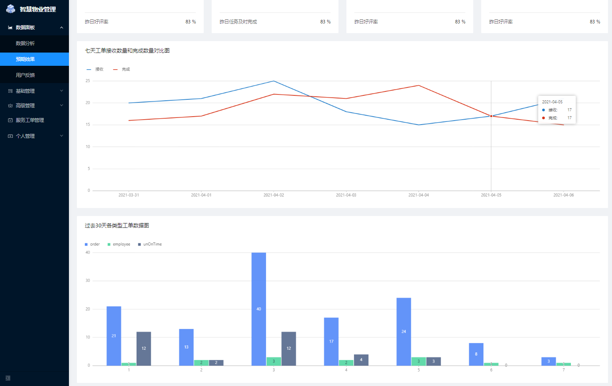
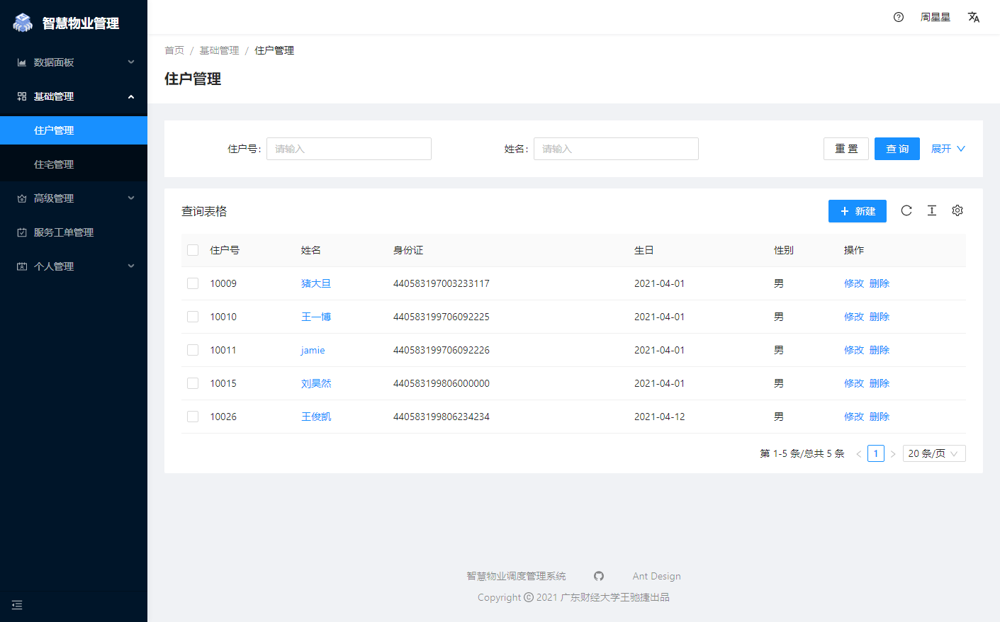
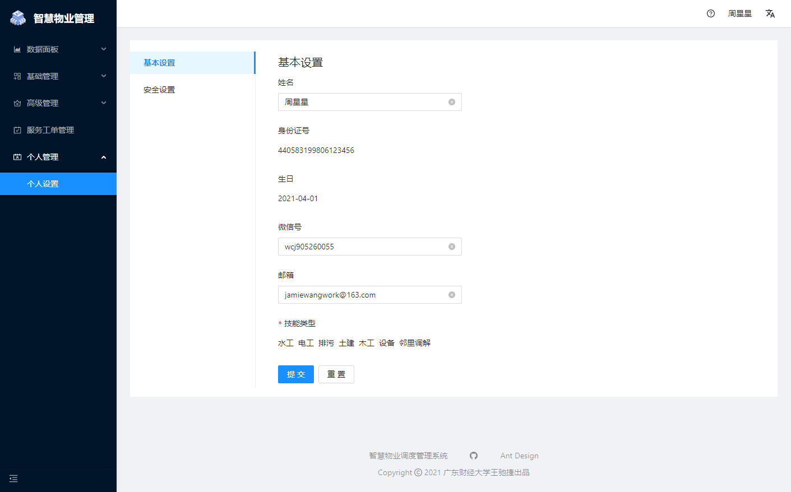

# Property-Management-System-Frontend

This project is initialized with [Ant Design Pro](https://pro.ant.design). Follow is the quick guide for how to use.

# Demo Preview

## Login Page


## Data Panel



## Management Page



## Personal Page



# Environment Prepare

Install `node_modules`:

```bash
npm install
```

or

```bash
yarn
```

# Provided Scripts

### Start project

```bash
npm start
```

### Build project

```bash
npm run build
```
